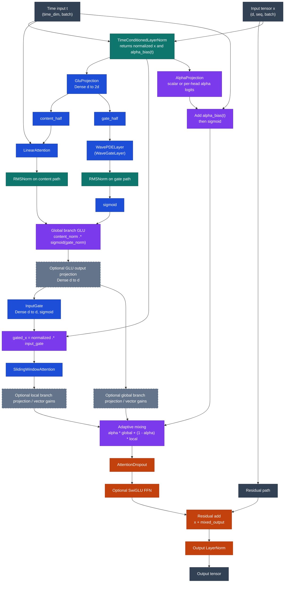

# Swamma Layer Diagram

```mermaid
flowchart TD
    classDef io fill:#334155,color:#ffffff,stroke:#1e293b
    classDef norm fill:#0f766e,color:#ffffff,stroke:#134e4a
    classDef branch fill:#1d4ed8,color:#ffffff,stroke:#1e3a8a
    classDef mix fill:#7c3aed,color:#ffffff,stroke:#5b21b6
    classDef out fill:#c2410c,color:#ffffff,stroke:#9a3412
    classDef opt fill:#64748b,color:#ffffff,stroke:#475569,stroke-dasharray: 5 5

    In["Input tensor x<br/>(d, seq, batch)"]:::io
    T["Time input t<br/>(time_dim, batch)"]:::io
    Residual["Residual path"]:::io
    In --> Residual

    TCLN["TimeConditionedLayerNorm<br/>returns normalized x and alpha_bias(t)"]:::norm
    In --> TCLN
    T --> TCLN

    GP["GluProjection<br/>Dense d to 2d"]:::branch
    TCLN --> GP

    CH["content_half"]:::branch
    GH["gate_half"]:::branch
    GP --> CH
    GP --> GH

    LA["LinearAttention"]:::branch
    LAN["RMSNorm on content path"]:::norm
    CH --> LA
    T --> LA
    LA --> LAN

    OSC["WavePDELayer<br/>(WaveGateLayer)"]:::branch
    OSCN["RMSNorm on gate path"]:::norm
    SIG["sigmoid"]:::branch
    GH --> OSC
    OSC --> OSCN
    OSCN --> SIG

    GLU["Global branch GLU<br/>content_norm .* sigmoid(gate_norm)"]:::mix
    LAN --> GLU
    SIG --> GLU

    GOP["Optional GLU output projection<br/>Dense d to d"]:::opt
    GLU --> GOP

    IG["InputGate<br/>Dense d to d, sigmoid"]:::branch
    Gated["gated_x = normalized .* input_gate"]:::mix
    GOP --> IG
    TCLN --> Gated
    IG --> Gated

    SWA["SlidingWindowAttention"]:::branch
    Gated --> SWA

    BG["Optional global branch projection / vector gains"]:::opt
    BL["Optional local branch projection / vector gains"]:::opt
    GOP --> BG
    SWA --> BL

    AP["AlphaProjection<br/>scalar or per-head alpha logits"]:::mix
    AB["Add alpha_bias(t)<br/>then sigmoid"]:::mix
    TCLN --> AP
    AP --> AB
    T --> AB

    Mix["Adaptive mixing<br/>alpha * global + (1 - alpha) * local"]:::mix
    BG --> Mix
    BL --> Mix
    AB --> Mix

    Drop["AttentionDropout"]:::out
    FFN["Optional SwiGLU FFN"]:::out
    Add["Residual add<br/>x + mixed_output"]:::out
    LN["Output LayerNorm"]:::out
    Out["Output tensor"]:::io

    Mix --> Drop
    Drop --> FFN
    FFN --> Add
    Residual --> Add
    Add --> LN
    LN --> Out
```
